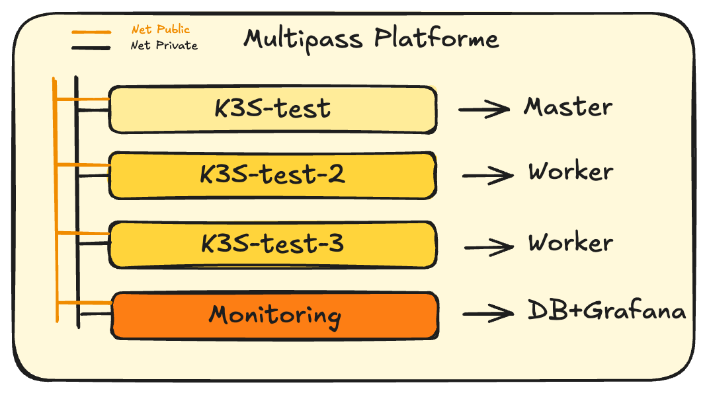
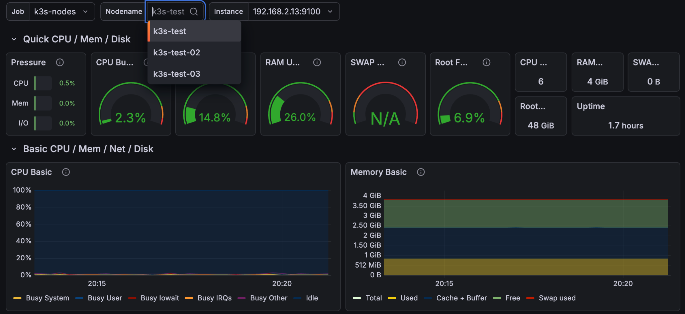
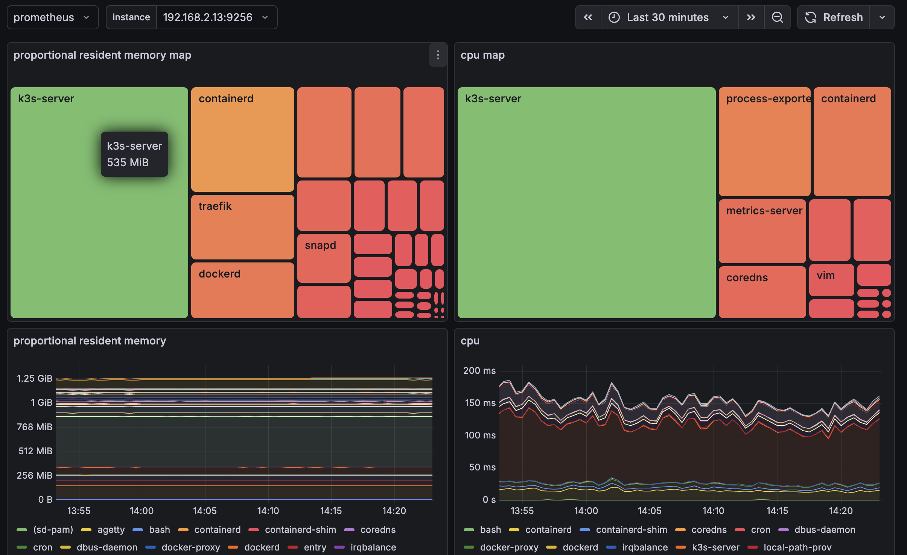
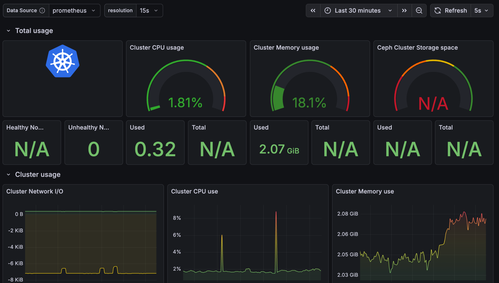

Projet soumis à licence Voir fichier ./[LICENSE](https://github.com/Paul-CHAVANON/grafana/blob/main/LICENSE)

# Grafana

## Présentation

Ce repository est composé en 4 parties

1. ***Contexte***

2. ***Compréhension simplifié*** de Multipass, Kube, Grafana & Prometheus pour ce POC

1. Pourquoi utiliser une plateforme de virtualisation comme **Multipass**

2. Pourquoi choisir K3S pour cet POC

3. Comment collecter les données et les interpréter

3. ***Configuration fonctionnelle de Grafana et prometheus*** Explication fonctionnelle de grafana et prometheus

4. ***Dashboard infrastructure*** monitoring de serveurs et services

5. ***Dashboard Kube***

## Contexte

### Objectif du projet

Dans l’objectif d'augmenter notre champ de vision sur les données d’états, de consommations des ressources d’infrastructures serveurs et des services. Pour une équipe d’exploitation technique sur des environnement de prod  et pré-prod.

Il est nécessaire d’obtenir une solution de monitoring adaptée au mieux à notre usage. Cela nous permet de diminuer de manière indirecte notre dette technique.

- Détection des dérives

- Réduction du temps de diagnostic ([MTTR](https://fr.mainsim.com/academy/mttr/), etc…)

- Priorisation rationnelle, décisions basées sur des données réelles.

- Historique technique

### Raison du projet

Pour un projet d’école (RNCP 7 Architecte SI) qui consiste à réaliser une refonte complète d’un SI, il est nécessaire de refaire l’architecture SI. Des solutions technique moderne sont nécessaire, voir document de proposition commercial lié au projet :


## Compréhension simplifié

1. [Multipass](https://canonical.com/multipass) est [Hyperviseur de type 2](https://fr.wikipedia.org/wiki/Hyperviseur) et utilise qemu et cloud-init pour créer les VM, il s’agit d’un outil Canonial il sera donc axés sur Ubuntu.

2. [K3Sup](https://makhal.fr/posts/k8s/cncf/k3sup/) est une solution simplifiée de Kubernetes permettant l’installation et la configuration en quelques commandes.

3. Collecte de données et exploitation :

***<span style="text - decoration: underline;">Prometheus***</span> va collecter des données pour nourrir une database, il lui est nécessaire d’avoir la configuration des cibles sur lesquelles récupérer les données. 

Pour que Prometheus collecte des données il en faut de disponible, donc via docker nous allons lancer des ***<span style="text - decoration: underline;">exportateurs de données***</span> orienté sur le sujet que nous souhaitons, exemple avec la configuration de notre serveur linux, kubernetes, etc… Un type de données un type d’exportateur. 

***<span style="text - decoration: underline;">Grafana***</span> via les données stocké dans prometheus va les exploiter sur différents dashboard, des règles personnalisé peuvent être réalisé voici deux exemple :  

<span style="text - decoration: underline;">Exemple 1</span> : Sur multipass j’ai 4 VM et je veux connaître l’espace disponible et la l’usage CPU, je fais donc un premier panel avec avec les Metrics des 4 VM en listant l’usage disk de chaque VM. J’aurais donc un tableau de 4 lignes indiquant l’espace disponible par VM.

<span style="text - decoration: underline;">Exemple 2</span> : Mon serveur consomme 600w je peux donc faire une règle qui, 1 fait une moyenne de la consommation, 2 faire une règle qui définit le prix fois la consommation, l’un des panel de notre dashboard indiquera le coût de fonctionnement de notre serveur

**Exemple de maquette** : 



Vous trouverez ici le site communautaire de grafana avec des dashboard réalisés par la communauté très pratique à utiliser et personnaliser.

source : [https://grafana.com/grafana/dashboards/](https://grafana.com/grafana/dashboards/)

## Configuration fonctionnelle de Grafana et prometheus

### Installer Docker

Source : [https://docs.docker.com/engine/install/ubuntu/](https://docs.docker.com/engine/install/ubuntu/)

### Installer Grafana et Prometheus

Utiliser un docker compose du fichier docker-compose.yml

Source : [./grafana_prometheus_config/docker-compose.yml](https://github.com/Paul-CHAVANON/grafana/blob/main/grafana_prometheus_config/docker-compose.yml)

```
sudo docker compose up -d
```
### Installer des exporter classic

Lancer les docker compose pour :

1. Analyse des données des VMs/serveurs [./node_exporter/docker-compose.yml](https://github.com/Paul-CHAVANON/grafana/blob/main/node_exporter/docker-compose.yml)

2. Analyse des performances GPU Nvidia [./nvidia_gpu_exporter/docker-compose.yml](https://github.com/Paul-CHAVANON/grafana/blob/main/nvidia_gpu_exporter/docker-compose.yml)

```
sudo docker compose up -d
```
### Configurer l'export de metrics Kube

Récupérer le certificat nécessaire sur le master node kube

```
sudo cat /var/lib/rancher/k3s/server/tls/server-ca.crt
```
Créer un Service Account et un token

```
# 1. Créer le ServiceAccount
sudo kubectl create serviceaccount prometheus -n default --dry-run=client -o yaml | kubectl apply -f -
# 2. Créer un ClusterRoleBinding robuste
# Cela lie le ServiceAccount au rôle 'system:kubelet-api-admin' ou 'view'
sudo kubectl create clusterrolebinding prometheus-cluster-view \
  --clusterrole=cluster-admin \
  --serviceaccount=default:prometheus
# 3. Créer le token
sudo kubectl create token prometheus
```
Puis le ajouter le token dans prometheus.yml, sinon les données ne sont pas disponible

```
  - job_name: 'k3s-kubelet'
    scheme: https
    bearer_token: "<NODE-TOKEN-HERE>" # Récupéré de votre cluster
    tls_config:
ca_file: /etc/prometheus/ca.crt # Récupéré de votre cluster
insecure_skip_verify: true
    static_configs:
- targets: ['<ip-serveur>:10250', '<ip-serveur>:10250', '<ip-serveur>:10250']
```
## Dashboard infrastructures

### Node Exporter full

Permet de connaître les données de chaque node, réseaux, RAM, CPU, …

Source : [Grafana-dashboard.com](https://grafana.com/grafana/dashboards/1860-node-exporter-full/)

## Dashboard Kubernetes cluster

Permet de connaître les données du cluster Kube, RAM, Pods, ...

Source : [Grafana-dashboard.com](https://grafana.com/grafana/dashboards/16450-kubernetes-views-k3s-cluster/) compatible K3S

## Mise en place de dashboards

### Dashboard des nodes

#### Pour analyser les ressources des nodes :

Source : [github.com/node_exporter/docker-compose.yml](https://github.com/Paul-CHAVANON/grafana/blob/main/node_exporter/docker-compose.yml)

Une fois installé les premières remontées d'informations des nodes peuvent être observé via dashboard

Source : [https://grafana.com/grafana/dashboards/1860-node-exporter-full/](https://grafana.com/grafana/dashboards/1860-node-exporter-full/)



#### Pour analyser des process précisément :

Objectif : Ce dashboard permet une visualisation directe des processus et de leur consommation pour permettre un debug facilité. Exemple : un processus en erreur qui recharge continuellement ce qui peut amener à une surconsommation, ralentissement et des pannes de serveurs ou de services par la suite.

Contrairement au Node exporter full qui indique l’état de la VM en détail et non celle de processus avec finesse.

Source : [https://github.com/ncabatoff/process-exporter](https://github.com/ncabatoff/process-exporter) \
Source : [https://grafana.com/grafana/dashboards/13882-process-exporter-dashboard-with-treemap/](https://grafana.com/grafana/dashboards/13882-process-exporter-dashboard-with-treemap/)



### Dashboard de Kube

Les stats des nodes sont intéressantes mais nous cherchons à connaître les statistiques de kube, il faut donc utiliser les données exposé par K3S, il faut donc intégrer dans notre Prometheus la clef du master node K3S, les données sont chiffre donc non lisible par la méthode traditionnelle de Prometheus

Source (Readme) : [github.com/configurer-](https://github.com/Paul-CHAVANON/grafana/blob/main/README.md#configurer-lexport-de-metrics-kube)[lexport](https://github.com/Paul-CHAVANON/grafana/blob/main/README.md#configurer-lexport-de-metrics-kube)[-de-metrics-kube](https://github.com/Paul-CHAVANON/grafana/blob/main/README.md#configurer-lexport-de-metrics-kube)

Source (Dashboard) : [grafana.com/dashboards/kubernetes-views-k3s-cluster/](https://grafana.com/grafana/dashboards/16450-kubernetes-views-k3s-cluster/)



Bonus : Nvidia Exporter

Source : [Grafana-dashboard.com](https://grafana.com/grafana/dashboards/14574-nvidia-gpu-metrics/)
